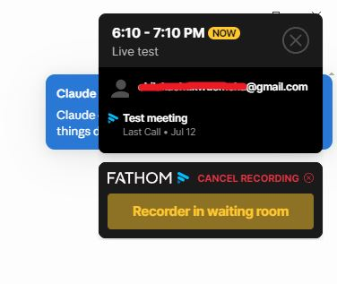
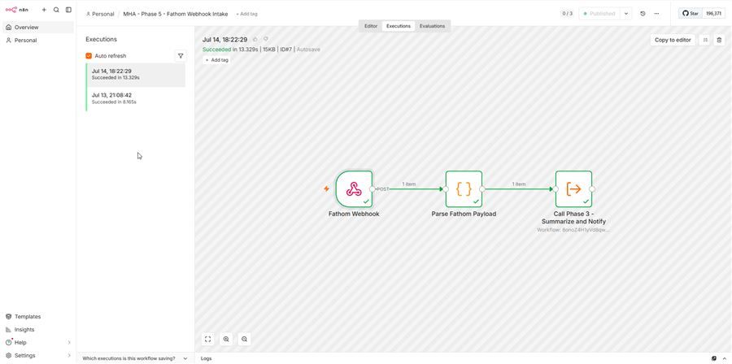
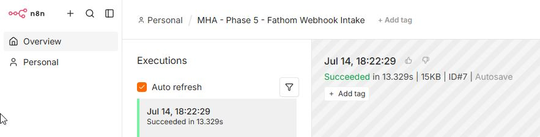
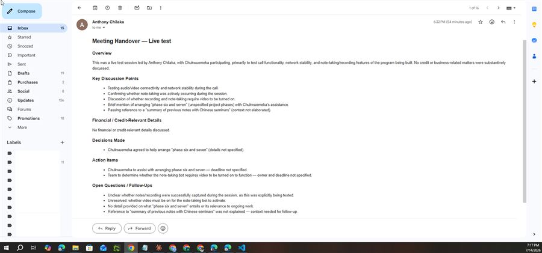

# Meeting Handover Automation 🤝 | n8n + Claude API | Banking & Fintech

## Executive Summary
A credit analyst needs a clear, structured record of every client call — but relies on someone else's memory and manual notes to get it, which means the detail is inconsistent and sometimes just doesn't happen. This project automates that entirely: the moment a call ends and its transcript is ready, the pipeline structures it into a standard analyst handover (overview, financial/credit details, decisions, action items, open questions) and emails it out — zero manual effort. Infrastructure runs at ~$7.09/month on a self-hosted n8n instance, with per-meeting cost down to a few cents of Claude API usage. The full chain has been proven with a real, live meeting end-to-end 🎯 — not a simulated test — so it's ready for real use today, with CRM sync and enterprise call-platform support scoped as clear next builds.

## Business Problem
Every client call currently ends with a manual write-up for a credit analyst who wasn't in the room — reconstructing financial details, decisions, and open questions from notes or memory. That's slow, inconsistent from one consultant to the next, and the easiest thing to shortcut under time pressure — which is a real problem when the output feeds credit-risk decisions. The brief: eliminate the manual step, keep the output analyst-grade, and keep the cost close to zero per meeting.

## Methodology
Built as an event-driven pipeline rather than scheduled polling — a webhook fires the moment a transcript is ready, so there's no lag and no wasted compute checking for meetings that haven't happened. n8n handles parsing and routing, Claude produces the structured summary from a purpose-built prompt, and Gmail sends it. A staging/production split lets every change get tested safely first. Event-driven was chosen deliberately over polling for lower latency and lower running cost.

## Skills Demonstrated
- 🔧 **Workflow Automation (n8n):** webhook triggers, Execute Workflow sub-flows, defensive payload parsing, staging → production promotion
- 🧠 **AI/LLM Integration:** Claude API (Sonnet 5), structured-output system prompt design, direct-to-HTML generation (no post-processing)
- 🔌 **API Integration & OAuth2:** Fathom webhook API (signature-verified), Gmail API (OAuth2)
- 🖥️ **Infrastructure & DevOps:** Docker Compose (Postgres, Redis, n8n queue mode), Nginx + Let's Encrypt SSL, Linux hardening (SSH keys, non-root sudo, firewall), automated backups
- 💰 **Cost Engineering:** self-hosted + usage-based billing in place of per-seat SaaS automation pricing

## Live Test Evidence
Screenshots from the real, unprompted Google Meet call used to verify Phase 7 end-to-end (2026-07-14) — not staged or simulated.

**1. Fathom capturing the live call**

**2. n8n pipeline executing on the real webhook**

**3. Real execution timestamp, tied to the actual call**

**4. The delivered handover email**

## Results & Business Recommendations
✅ Full pipeline live-tested end-to-end with a real meeting: transcript capture → structured summary → email delivery, all within under a minute of the call ending.
✅ Net new infrastructure cost: ~$7.09/month (VPS) + cents-per-meeting in Claude API usage — no per-seat automation platform fees.
✅ Output correctly separates signal from noise: in live testing it accurately reported "no financial/credit-relevant details discussed" rather than inventing content — the trait that matters most in a document analysts will actually rely on.

**Recommendations:**
1. 🔗 Add a CRM sync (e.g. GoHighLevel) so handovers attach directly to the client record — contingent on confirming the client's plan includes API access.
2. 📞 Move from the demo trigger (Fathom) to the client's real call platform (Zoom or Microsoft Teams) once admin-level API/webhook access is provisioned.
3. 🗄️ Export and version-control workflow JSON after every build phase — a documentation gap flagged internally, worth closing before a real client rollout.

## Next Steps
- CRM sync and production call-platform integration are deliberately out of scope here — tracked as separate follow-on builds.
- Multi-consultant routing is already designed (keyed on the webhook's `recorded_by` field) but not yet built — natural next step if the client adds consultants.
- **Limitation to flag:** current validation is one real meeting plus schema-matched synthetic payloads — worth testing against a wider range of meeting lengths and topics before relying on this for a live client engagement.
